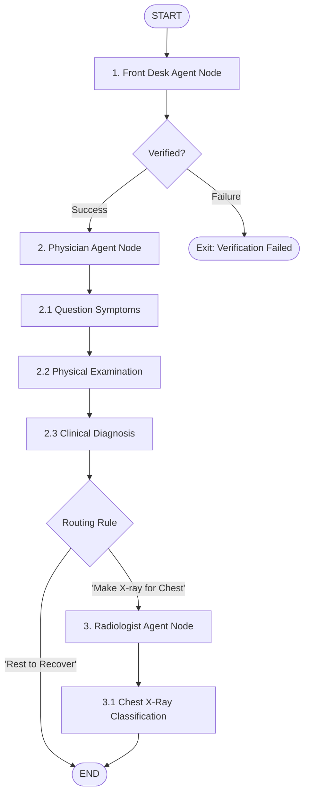

# Hospital Simulation Agentic AI Project

An agentic multi-agent healthcare workflow simulation built using **LangGraph**, **LangChain**, **Google Gemini 3.5**, and **Hugging Face pre-trained Vision Transformers (ViTs)**. The project simulates a patient’s journey through a hospital, from verification at the front desk, to consultation/diagnosis by a physician, and finally to advanced diagnostics by a radiologist.

---

## 🏥 Workflow Architecture

The hospital workflow is orchestrated as a directed state graph using `langgraph`. The state flows sequentially between specialized nodes, with conditional routing based on the physician's clinical diagnosis.



---

## 🤖 Multi-Agent Breakdown

### 1. Front Desk Agent (Identity Verification)
* **Goal**: Validate that the patient checking in matches their registered hospital record.
* **Mechanism**:
  * Reads the patient's Face ID image (from `datasets/FaceID/image1.png`).
  * Runs two pre-trained ViT models from Hugging Face:
    * **Gender Classification**: `rizvandwiki/gender-classification`
    * **Age Group Prediction**: `nateraw/vit-age-classifier` (predicts ranges like `20-29`, `30-39`, etc.)
  * Queries the database (`updated_patient_df.csv`) to check if a patient with the given `Patient_ID`, name, gender, and age match exists.
  * If verified, writes the success status to the graph state and passes the patient to the Physician.

### 2. Physician Agent (Consultation & Diagnosis)
* **Goal**: Perform anamnesis, record physical exam details, and determine clinical routing.
* **Mechanism**:
  * **Questioning Patient**: Replicates a clinical conversation asking about common symptoms like Cough, Fatigue, and Difficulty Breathing based on patient metrics.
  * **Examination**: Records vital signs and values (Fever, Blood Pressure, Cholesterol Level).
  * **Diagnosis**: Synthesizes the clinical picture.
    * If severe symptoms are present (e.g. difficulty breathing, fever), the agent determines a diagnosis recommending a chest scan (`"Make X-ray for Chest"`).
    * Otherwise, the patient is advised `"Rest to Recover"`.

### 3. Radiologist Agent (Imaging Diagnostics)
* **Goal**: Analyze the chest X-ray image to detect anomalies (Pneumonia vs. Normal).
* **Mechanism**:
  * Activated conditionally if the Physician requests a chest X-ray.
  * Loads chest X-ray images from a directory using the Hugging Face `datasets` library.
  * Runs a Vision Transformer (ViT) model:
    * **Pneumonia Detector**: `lxyuan/vit-xray-pneumonia-classification`
  * Updates the state with the classification outcome (`NORMAL` or `PNEUMONIA`).

---

## 🗃️ Codebase Directory Structure

* **`NTBK_finalWorkflow.ipynb`**: The final integrated notebook defining the `AgentState` schema, compiling the `StateGraph`, and executing the entire multi-agent simulation workflow.
* **`models.py`**: Python file containing the core AI models and helper classification functions (Gemini model connector, gender model pipeline, age group model pipeline).
* **`SystheticDataGenerationPatient.py`**: A synthetic data generator utility using Gemini and LangChain output parsers to generate formatted mock patient records in JSON format.
* **`NTBK1_MedicalDatabasePreparation.ipynb`**: Prepares and structures the patient dataset from raw CSV formats.
* **`NTBK2_IdentityPhotoForTheFrontDeskAgent.ipynb`**: Development sandbox for the Face ID models.
* **`NTBK3_BuildingMultiAgents.ipynb` / `NTBK4_Physician_Agent.ipynb` / `NTBK5_Radialogist_Agent.ipynb`**: Individual prototype notebooks used for building and unit-testing agents before orchestration.
* **`datasets/`**: Project dataset folder containing:
  * `input/processed/updated_patient_df.csv`: The patient directory records.
  * `FaceID/`: Patient face verification photos.
  * `input/chest_xray/`: X-ray imaging files categorized for training and evaluation.

---

## ⚙️ State Schema & Variables

The workflow maintains graph persistence via `AgentState` (`TypedDict`):

| State Key | Type | Description |
|---|---|---|
| `initial_prompt` | `str` | Entry point query string to trigger the workflow. |
| `messages` | `Annotated[List[BaseMessage], operator.add]` | Message history representing agent interactions. |
| `patient_verification` | `str` | Logs verification results from the Front Desk. |
| `prediction` | `str` | Stores pneumonia classification results (`NORMAL` vs `PNEUMONIA`). |
| `question_patient` | `str` | Symptom screening logs. |
| `examination_patient`| `str` | Physical examination summary. |
| `diagnosis_patient` | `str` | Final diagnosis text description. |
| `diagnosis` | `str` | Routing variable (determines if conditional edge redirects to radiologist). |

---

## 🛠️ Getting Started

### 1. Prerequisites
Ensure you have Python 3.10+ and the required dependencies installed:
```bash
pip install pandas numpy pillow datasets transformers langchain langchain-core langgraph python-dotenv google-genai
```

### 2. Environment Setup
Create a `.env` file in the root directory to store your API credentials:
```env
# Gemini API Key configuration
GOOGLE_API_KEY=your_gemini_api_key_here
```

### 3. Execution
Open and execute the final workflow:
1. Run `NTBK1_MedicalDatabasePreparation.ipynb` to construct and verify the mock database.
2. Launch `NTBK_finalWorkflow.ipynb` to run the state graph from `START` to `END`.
